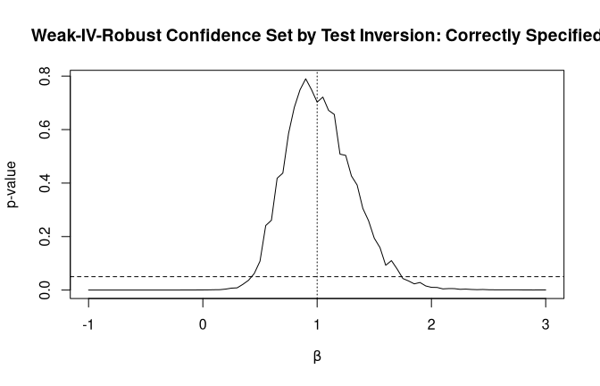
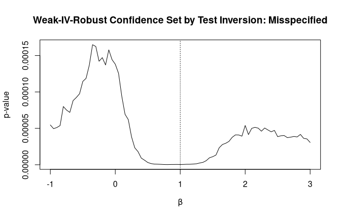

<!-- README.md is generated from README.Rmd. Please edit that file -->

# RPIV

<!-- badges: start -->

[](https://github.com/cyrillsch/RPIV/actions/workflows/R-CMD-check.yaml)
<!-- badges: end -->

The `RPIV` package implements residual prediction tests for the
well-specification of linear instrumental variable (IV) models, as
developed in Scheidegger, Londschien and Bühlmann (2025).

For a response $Y_i \in \mathbb R$, endogenous regressors
$X_i \in \mathbb R^p$, instruments $Z_i \in \mathbb R^d$ with $d \ge p$,
and optional exogenous control variables $C_i \in \mathbb R^q$, the
package provides two related procedures:

1.  `RPIV_test()`: a residual prediction test for the well-specification
    of the linear IV model under strong identification;
2.  `weak_RPIV_test()`: a weak-IV-robust version that tests the
    conditional moment restriction at a given candidate parameter value
    and can be inverted to obtain confidence sets.

The main question addressed by the package is whether the linear IV
model is an appropriate description of the data.

More formally, the standard test targets the null hypothesis
$H_0:\ \exists \beta \in \mathbb R^p \text{ such that } \mathbb E[Y_i - X_i^T\beta \mid Z_i] = 0 \quad \text{a.s.}$
which is implied by the well-specification of the linear IV model (with
mean-independence assumption on the errors).

When exogenous controls are present, the model is understood as allowing
for an additional linear term in $C_i$, and in the standard
implementation these controls are added both to $X$ and to $Z$.

The weak-IV-robust procedure instead considers, for a fixed candidate
value $\beta_0 \in \mathbb R^p$, the null hypothesis
$H_0(\beta_0):\ \exists \theta \in \mathbb R^q \text{ such that }
\mathbb E[Y_i - X_i^T\beta_0 - C_i^T\theta \mid Z_i, C_i] = 0 \quad \text{a.s.}$
By fixing $\beta_0$, the test avoids relying on strong identification.
Inverting the test over a grid of candidate values yields a confidence
set for the endogenous coefficient(s). If this confidence set is empty,
the data provide evidence against well-specification.

The underlying idea of both tests is to check for signal in the
residuals using a random forest. For a detailed discussion of the
methodology, we refer to Scheidegger, Londschien and Bühlmann (2025). A
Python implementation of the residual prediction approach is available
in the package [ivmodels](https://github.com/mlondschien/ivmodels).

## Installation

You can install the released CRAN version of `RPIV` with

``` r
install.packages("RPIV")
```

You can install the development version from GitHub with

``` r
devtools::install_github("cyrillsch/RPIV")
```

## Example: Standard RPIV Test

The following example illustrates how to test the well-specification of
a linear IV model with `RPIV_test()`. We simulate three outcomes: one
generated from a well-specified linear IV model, and two generated under
misspecification.

``` r
set.seed(1)
n <- 200
C <- rnorm(n)
Z <- cbind(rnorm(n), C + rnorm(n))
H <- rnorm(n)
X <- Z[, 1] - Z[, 2] + rnorm(n)

Y1 <- X - C + H + rnorm(n)
Y2 <- X - C + H + Z[, 1]^2 + rnorm(n)
Y3 <- 2 * sign(X - C) + H + rnorm(n)
```

We apply `RPIV_test()` to all three outcomes. By default, the function
uses a heteroskedasticity-robust variance estimator.

``` r
library(RPIV)

result1 <- RPIV_test(Y = Y1, X = X, C = C, Z = Z)
result2 <- RPIV_test(Y = Y2, X = X, C = C, Z = Z)
result3 <- RPIV_test(Y = Y3, X = X, C = C, Z = Z)

result1$p_value
#> [1] 0.1575286
result2$p_value
#> [1] 0.0004228503
result3$p_value
#> [1] 0.005525054
```

As expected, the null of well-specification is not rejected for `Y1`,
while it is rejected for `Y2` and `Y3` at significance level
$\alpha = 0.05$.

## Example: Weak-IV-Robust RPIV Test

The function `weak_RPIV_test()` provides a weak-IV-robust version of the
procedure. Rather than testing whether there exists some coefficient
vector satisfying the conditional moment restriction, it tests the null
hypothesis at a fixed candidate value `beta`.

A key use case is **test inversion**: we evaluate the test over a grid
of candidate values and retain those values that are not rejected, i.e.,
the values that are compatible with well-specification at a given
significance level. Under well-specification, the resulting set is a
confidence set for the endogenous coefficient. If this set is empty, the
data provide evidence against well-specification of the linear IV model.

In the next example, we consider two outcomes:

- `Y1`, generated from a correctly specified linear IV model with true
  coefficient `beta = 1`;
- `Y2`, generated under misspecification through an additional nonlinear
  term in the instrument.

``` r
set.seed(1)
n <- 200
Z <- rnorm(n)
C <- rnorm(n)
H <- rnorm(n)
X <- Z + rnorm(n) + H

Y1 <- X - C - H + rnorm(n)       # correctly specified, true beta = 1
Y2 <- X - C - H + Z^2 + rnorm(n) # misspecified conditional moment restriction
```

We now construct the weak-IV-robust test for both outcomes.

``` r
library(RPIV)

test_statistic1 <- weak_RPIV_test(Y = Y1, X = X, C = C, Z = Z)
test_statistic2 <- weak_RPIV_test(Y = Y2, X = X, C = C, Z = Z)
```

Next, we evaluate the test over a grid of candidate values. Since the
test statistic is asymptotically standard Gaussian under the null, we
obtain one-sided p-values as `1 - pnorm(statistic)`. The confidence set
at level `1 - alpha` is then the set of candidate values whose p-values
are at least `alpha`.

``` r
beta_grid <- seq(-1, 3, by = 0.05)
alpha <- 0.05

stats1 <- sapply(beta_grid, function(b) test_statistic1(b, "fit"))
pvals1 <- 1 - pnorm(stats1)
confset1 <- beta_grid[pvals1 >= alpha]

stats2 <- sapply(beta_grid, function(b) test_statistic2(b, "fit"))
pvals2 <- 1 - pnorm(stats2)
confset2 <- beta_grid[pvals2 >= alpha]
```

The confidence sets obtained by inversion are:

``` r
confset1
#>  [1] 0.45 0.50 0.55 0.60 0.65 0.70 0.75 0.80 0.85 0.90 0.95 1.00 1.05 1.10 1.15
#> [16] 1.20 1.25 1.30 1.35 1.40 1.45 1.50 1.55 1.60 1.65 1.70
confset2
#> numeric(0)
```

For the correctly specified outcome `Y1`, the confidence set contains
values close to the true parameter `beta = 1`. For the misspecified
outcome `Y2`, the confidence set is empty reflecting the fact that no
candidate value satisfies the conditional moment restriction.

It is also useful to visualize the p-values over the grid. Values above
the horizontal line at `alpha = 0.05` belong to the confidence set.

``` r
plot(beta_grid, pvals1,
     type = "l",
     xlab = expression(beta),
     ylab = "p-value",
     main = "Weak-IV-Robust Confidence Set by Test Inversion: Correctly Specified")
abline(h = alpha, lty = 2)
abline(v = 1, lty = 3)
```



``` r
plot(beta_grid, pvals2,
     type = "l",
     xlab = expression(beta),
     ylab = "p-value",
     main = "Weak-IV-Robust Confidence Set by Test Inversion: Misspecified")
abline(h = alpha, lty = 2)
abline(v = 1, lty = 3)
```



In this example we used `type = "fit"`, which reuses the tuning
parameters obtained at the TSLS residuals and only refits the random
forest for each candidate value. This is often a good compromise between
statistical accuracy and computational cost when evaluating the test on
a grid.

Other options for the argument `type` are `"tune_and_fit"`, which
retunes and refits the random forest for the current candidate value,
and `"recalculate"`, which reuses the partition obtained at the TSLS
residuals and only recomputes leaf means.

## Example: Cluster-Robust Inference

The package also supports cluster-robust inference. In the next example,
we simulate clustered data with 50 clusters of size 4. The linear IV
model is well-specified, but valid inference requires accounting for the
clustering structure.

``` r
set.seed(1)
n <- 200
clustering <- rep(1:50, length.out = n)

Z <- rep(rnorm(1:50), length.out = n) + 0.1 * rnorm(n)
H <- rep(rnorm(1:50), length.out = n) + 0.1 * rnorm(n)
X <- Z + rep(rnorm(1:50), length.out = n) + 0.1 * rnorm(n)
Y <- X + H + rep(rnorm(1:50), length.out = n) + 0.1 * rnorm(n)
```

We apply the test with three different variance estimators:
homoskedastic, heteroskedastic, and cluster-robust.

``` r
result <- RPIV_test(
  Y = Y,
  X = X,
  C = NULL,
  Z = Z,
  variance_estimator = c("homoskedastic", "heteroskedastic", "cluster"),
  clustering = clustering
)

result$homoskedastic$p_value
#> [1] 0.02844595
result$heteroskedastic$p_value
#> [1] 0.01728716
result$cluster$p_value
#> [1] 0.1347029
```

In this setting, only the cluster-robust variance estimator should
typically avoid spurious rejection at significance level
$\alpha = 0.05$.

## More Examples

More examples can be found in Scheidegger, Londschien and Bühlmann
(2025) and in the accompanying GitHub repository
[RPIV_Application](https://github.com/cyrillsch/RPIV_Application).

## References

Cyrill Scheidegger, Malte Londschien and Peter Bühlmann.
*Machine-learning-powered specification testing in linear instrumental
variable models*. Preprint, arXiv:2506.12771, 2025.
